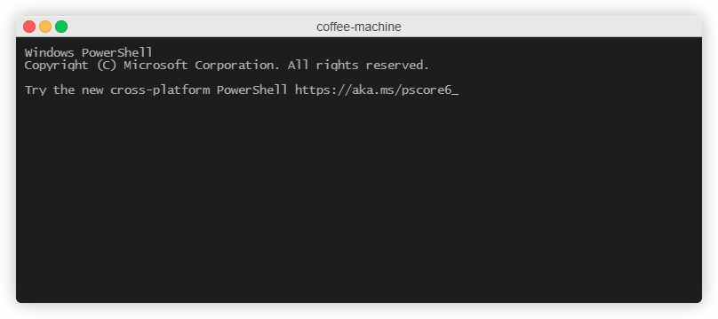

# Coffee Machine

One of my projects created at hyperskill platform. Program simulates a coffe machine. Machine operates with the folowing products: coffee, milk, sugar, plastic cups and also collects money. When it runs out of any of these products it notifies user. Coffee machine can prepare three types of coffeee: espresso, cappuccino and latte.

## Table of contents

- [General info](#general-info)
- [Screencast](#screencast)
- [Technologies](#technologies)
- [Status](#status)
- [Inspiration](#inspiration)

## Screencast

## General info

Start main at src/CoffeMachine.java

## Technologies

Java

## Status

Project is: _finished_

## Inspiration

Hyperskill project
